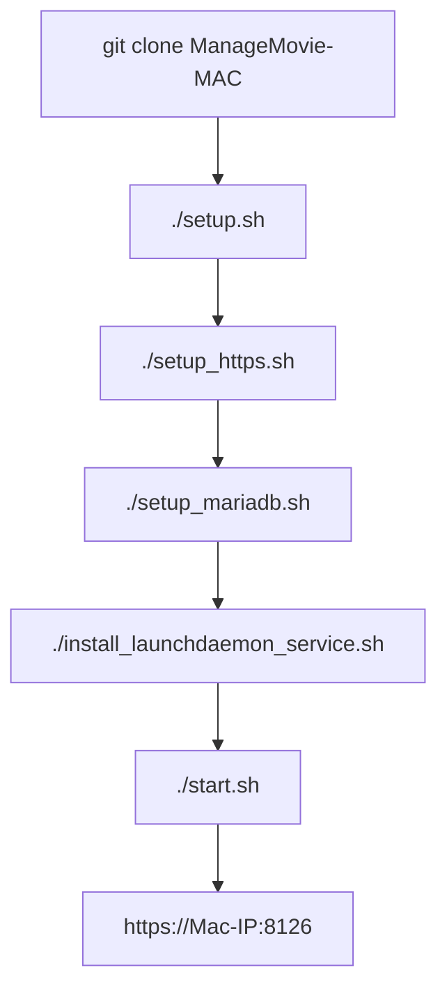

Version: 0.2.20

# ManageMovie MAC Flowchart

```mermaid
flowchart TD
    A["git clone ManageMovie-MAC"] --> B["./setup.sh"]
    B --> C["./setup_https.sh"]
    C --> D["./setup_mariadb.sh"]
    D --> E["./install_launchdaemon_service.sh"]
    E --> F["./start.sh"]
    F --> G["https://Mac-IP:8126"]
```
